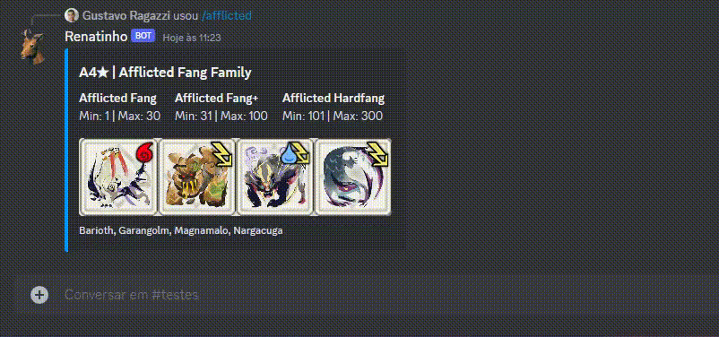

# Discord-bot

This project is a Discord bot created to perform various functions. It was developed using the discord.js library.

## Installation for Development

To get started with the project, follow these steps:

1. Clone this repository.
2. Create a file named `.env` in the project's root directory using the provided [example.env](example.env) as a template.
3. Run the command `npm install` to install the necessary dependencies.
4. Initialize global commands with `npm run commands-global`.
5. Start the development bot with `npm run dev`.

## Usage

Once the commands are registered, they are ready for use in Discord and can be accessed using the `/` prefix. The currently available commands are:

* **/ping**: A simple command to test the bot's responsiveness.

* **/backup-kelbi**: This command allows you to obtain a partial or complete backup of the [Kelbi](https://github.com/Invasor-de-Fronteiras/Kelbi) database and send it by email and/or save it locally. To use this command, you must have the database installed and log in with an account that has the "dev" flag set to true.

* **/afflicted**: Returns information in an "embed" format, retrieved from the [afflictedItems.json](assets/afflictedItems.json) file.

 

